# pkg-peep 👀

A Model Context Protocol (MCP) server for NPM package intelligence. Get download statistics, package metadata, and dependency information for any NPM package.

## How It Works

This MCP server exposes NPM registry APIs as tools that Q CLI and Claude can use:

1. **MCP Protocol**: Server communicates with AI clients via Model Context Protocol
2. **Tool Registration**: NPM API endpoints become callable tools
3. **No Authentication**: Uses public NPM APIs (no API key required)
4. **JSON Responses**: All package data returned as formatted JSON

## pkg-peep MCP Architecture

```mermaid
%%{init: {'flowchart': {'curve': 'basis'}}}%%
graph LR
    A["💻<br/>Q CLI"] -.-> B["🔌<br/>MCP Server"]
    C["💻<br/>Claude Code"] -.-> B
    B <--> D["📦<br/>NPM Registry API"]
    B <--> E["📊<br/>NPM Downloads API"]
    
    style A fill:#6366f1,stroke:#000,stroke-width:3px,color:#fff
    style C fill:#ff9900,stroke:#000,stroke-width:3px,color:#000
    style B fill:#C11C84,stroke:#000,stroke-width:3px,color:#fff
    style D fill:#cb3837,stroke:#000,stroke-width:3px,color:#fff
    style E fill:#10b981,stroke:#000,stroke-width:3px,color:#000
```



When you ask Q CLI or Claude Code to "get download stats for react", it:
1. Calls the `get_npm_downloads` tool
2. Server makes API request to NPM Downloads API
3. Returns formatted results to the AI client
4. The agent presents the data to you in context

## Features

- 📊 **Download Statistics** - Weekly, monthly, daily, or custom date ranges
- 📦 **Package Metadata** - Versions, dependencies, maintainers, license info
- 🔍 **Comprehensive Info** - Repository links, keywords, creation dates
- ⚡ **Fast & Reliable** - Direct NPM registry API integration
- 🔑 **No API Key Required** - Uses public NPM APIs

## Tools

### `get_npm_downloads`
Get download statistics for any NPM package.

**Parameters:**
- `package` (required): NPM package name
- `period` (optional): `last-day`, `last-week`, `last-month`
- `startDate` (optional): Custom start date (YYYY-MM-DD)
- `endDate` (optional): Custom end date (YYYY-MM-DD)

**Example Response:**
```json
{
  "downloads": 50766634,
  "start": "2025-08-27",
  "end": "2025-09-02", 
  "package": "react"
}
```

### `get_npm_package_info`
Get comprehensive package metadata.

**Parameters:**
- `package` (required): NPM package name

**Example Response:**
```json
{
  "name": "react",
  "description": "React is a JavaScript library for building user interfaces.",
  "latest": "19.1.1",
  "license": "MIT",
  "homepage": "https://react.dev/",
  "repository": {
    "url": "git+https://github.com/facebook/react.git",
    "type": "git"
  },
  "maintainers": [
    {"name": "fb", "email": "opensource+npm@fb.com"}
  ],
  "dependencies": {...},
  "created": "2011-10-26T17:46:21.942Z"
}
```

## Installation

### For Amazon Q CLI

1. Clone or download this repository
2. Install dependencies:
   ```bash
   npm install
   ```
3. The MCP server is ready to use with Q CLI's MCP support

### For Claude Desktop

Add to your Claude Desktop configuration:

```json
{
  "mcpServers": {
    "pkg-peep": {
      "command": "node",
      "args": ["/path/to/pkg-peep/index.js"]
    }
  }
}
```

### Using NPX (Recommended)

```json
{
  "mcpServers": {
    "pkg-peep": {
      "command": "npx",
      "args": ["-y", "pkg-peep"]
    }
  }
}
```

## Usage Examples

**Get weekly downloads:**
```
Get download stats for "react" package
```

**Custom date range:**
```
Get download stats for "lodash" from 2024-01-01 to 2024-12-31
```

**Package information:**
```
Get package info for "express"
```

## Testing

Run the test suite to verify everything works:

```bash
npm test
```

The tests verify:
- ✅ Tool registration (both download and package info tools)
- ✅ Download stats for popular packages
- ✅ Different time periods (daily, weekly, monthly)
- ✅ Package metadata retrieval
- ✅ Custom date ranges
- ✅ Error handling for non-existent packages

**📋 [Example Prompts >>](EXAMPLES.md)** - Try these sample queries to test your MCP!

## Development

```bash
# Install dependencies
npm install

# Run the server
node index.js

# Test with a simple request
echo '{"jsonrpc": "2.0", "id": 1, "method": "tools/list"}' | node index.js
```

## API Endpoints Used

- NPM Downloads API: `https://api.npmjs.org/downloads/`
- NPM Registry API: `https://registry.npmjs.org/`

## License

MIT

## Contributing

Issues and pull requests welcome! This MCP server uses the official Model Context Protocol SDK.
